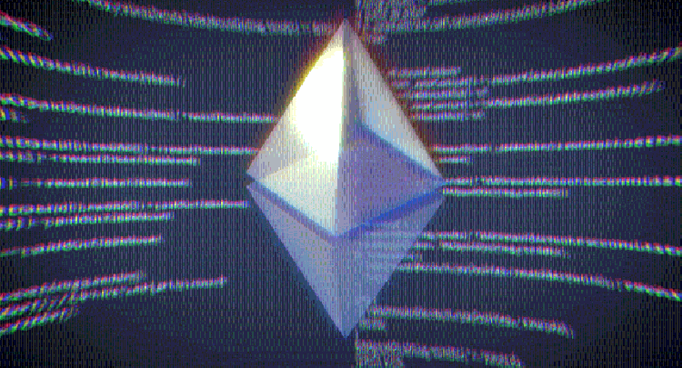
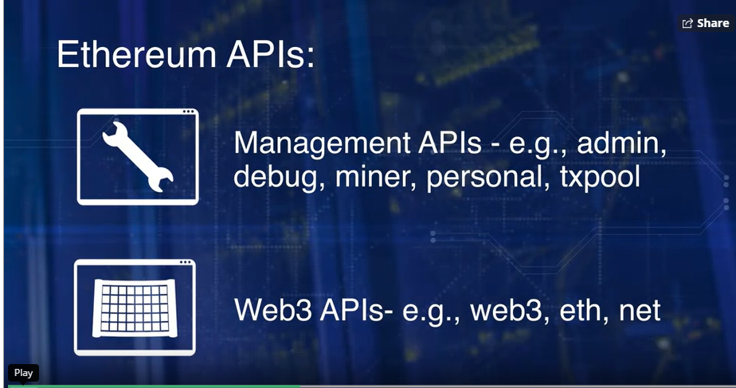
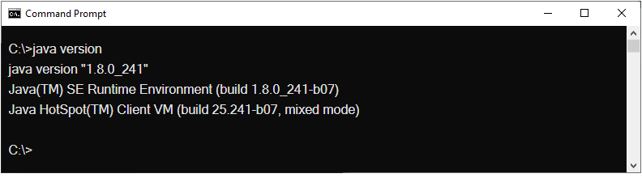
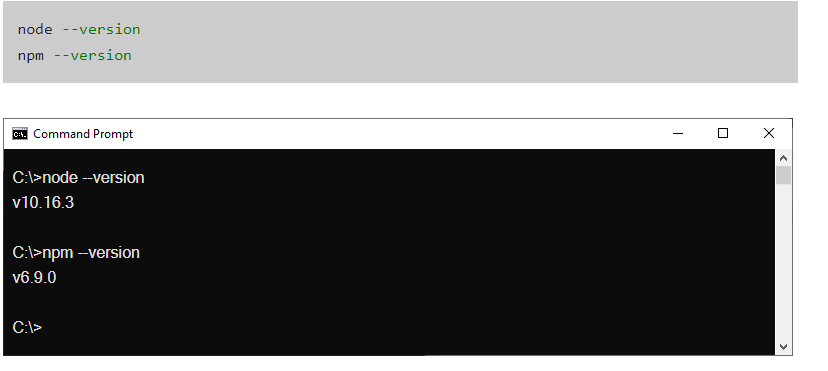
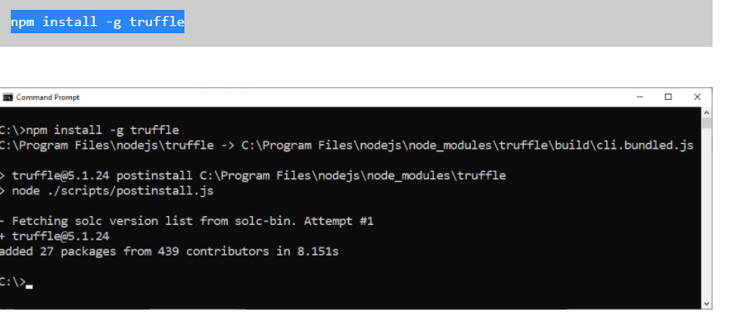
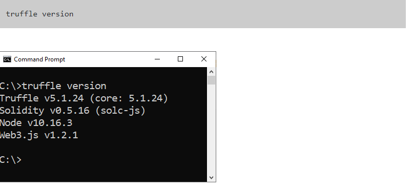

# DAPPS

-----
### Ethereum APIs 
#### Two type of APIs
01.Management APIs
The Managemet API support methods for management of geth node. 

02.Web3 APIS. 
The Web3 APIs support methods for development of Dapps.

#### APIs in detail. 

## Management APIs

### 01.Admin API

Example: admin.addPeer(),admin.nodeInfo(), admin works as an API and .nodeInfo,or addPeer work as a function.

Admin, the Admin API allows you to use functions to work with your Geth instance, including network peer and the RPC endpoint management. Examples, admin.addPeer(), admin.nodeInfo(). In this case, admin is the API, and addPeer and nodeInfo are functions of the admin API. You can observe that admin supports functions for management of the node. 

### 02. Debug API

Example: debug.dumpBlock(16)

Debug API, example, Debug.dumpBlock(16). This will display the block header details of block 16. You can observe that the debug API provides you the ability to peek into the blockchain, study it, and debug any issues by looking at the block.

### 03. Miner API

Example: miner.start(),miner.strop()

Miner API, the miner API allows you to control the nodes mining operation and set various mining specific settings.

### 04. Personal API

Personal API deals with the creation and management of accounts within a node. It also manages private keys in the key store,

Example, personal.newAccount() will create a new account within a node.

### 05. Txpool API.

gives you access to several non-standard RPC methods to inspect the contents of the transaction pool,containing all the currently pending transaction, as well as those queued for future processing. Example, txpool.inspect() lists you all the pending transactions for you to peruse and collect for building a block of transactions.

## web3 APIs

Web3 is a JavaScript library that's specifically designed for use with web client or Ethereum Dapps. It's a portal through which all the underlying operations of the Ethereum node on the blockchain server can be invoked. For example, a Smart Contract deployment and Smart Contract function invocation.

# END TO END DAPP.

### Four Steps of Design Process:

1. Define data & operations.
2. Add modifiers and validation checks.
3. Perform uint testing.
4. Integration testing.

## To Install Truffle, You NEED!

#### JAVA

If you dont have java you can install java in official Java download page, download, and run the installer from there.
https://www.java.com/en/download/ 

 

#### Node.js and NPM

Also, you can install Node.js in. 

https://nodejs.org/en/

## Truffle install

#### Chk Truffle version

